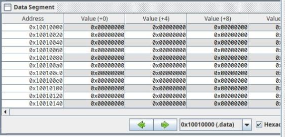
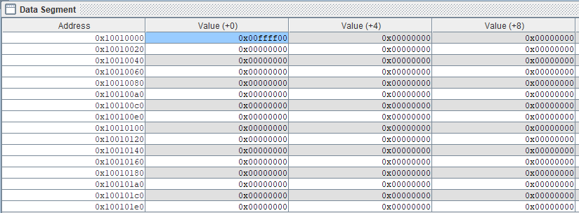
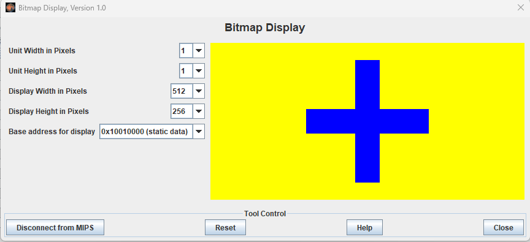

# Webviews!
- Create webviews for
    - Registers?
        - Shouldn't have to, these should display in the debugging section of VSCode
    - The memory view within MARS
        - Code used here is in LukesNotes\mips_test.asm
        - 
            - The memory view at the start of the program, before anything is stored
        - 
            - The memory view after the first sw instruction is run    
    - A bitmapped display
        - Code used here is in LukesNotes\bitmapex.asm
        - 
        - Reads color data in from MIPS memory (the cells shown in the memory view)
            - Display said data as pixels in the display window